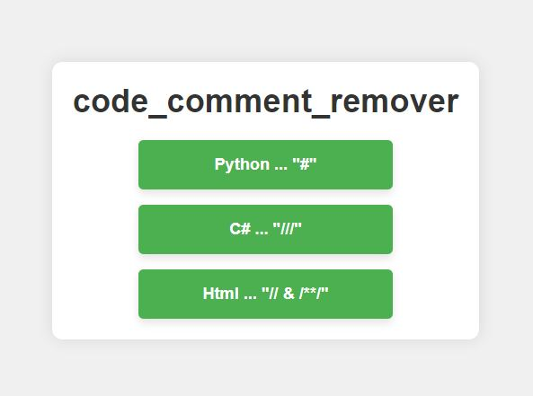

# Comment Remover

A simple web-based tool to remove triple-slash (`///`) comments from your code. This tool allows you to paste code into a text area, remove comments with a single click, and copy the cleaned code to your clipboard.

## Features

- **Remove Comments:** Strips out all `///` comments from the code.
- **Copy to Clipboard:** Quickly copy the cleaned code for use elsewhere.
- **Responsive Design:** Easy to use on both desktop and mobile devices.

## How to run 
- download the repo files
- open the menu.html file in a browser

